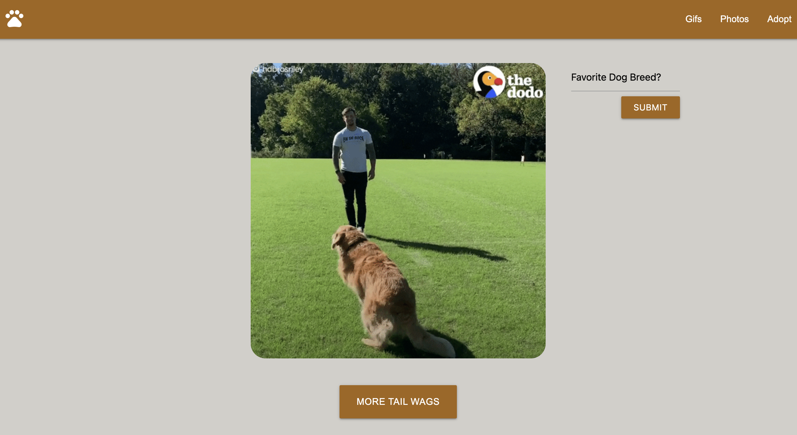

# Daily Dose of Dogs - AKA "Triple D"

## Description: 

This website serves as a location to view pictures and gifs of dogs for stress relief. It has been well documented that people who view pictures of dogs decrease their stress levels and overall are put into a better mood. A future feature that we would like to implement into this is the ability to find animal shelters in your area to adopt! This project is the users one stop shop for your stress relieving, dog viewing, page!

## Installation

What are the steps required to install your project? Provide a step-by-step description of how to get the development environment running.

## Usage

User starts at the 'landing page' where they are greeted by a dog at the foot of the page! From here the user can make their choice between a still photo or a cute funny gif!

When the user selects Gifs, this is the page they will see! The gif will be different each time and the user can even enter what kind of dog they would like to see! Feature coming soon. 

When the user selects Photos, this is the page they will see! The photo will be different each time!

This last page is where the user can search for a local animal shelter! Feature isn't quite ready, but in the future will be a one stop spot for finding your local shelter!

## Credits

List your collaborators, if any, with links to their GitHub profiles.

If you used any third-party assets that require attribution, list the creators with links to their primary web presence in this section.

If you followed tutorials, include links to those here as well.

